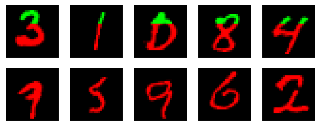

# [It's Raw! Audio Generation with State-Space Models](https://arxiv.org/abs/2202.09729)

Karan Goel, Albert Gu, Chris Donahue, Christopher Ré

[*ICML 2022*](https://icml.cc/virtual/2022/poster/17773)

<p align="center"></p>

_Samples from a SaShiMi model trained on MNIST. Green parts represent the priming signal. Red parts are generated by the model._

**Listen to our audio samples [in this link](https://user.ceng.metu.edu.tr/~ilker/sashimi/).**

This repository provides a re-implementation of this paper in PyTorch, developed as part of the course METU CENG 796 - Deep Generative Models.
This re-implementation is provided by:
* İlker Işık, e238051@metu.edu.tr
* Muhammed Can Keleş, e265013@metu.edu.tr

Please see the following Jupyter Notebooks for more information:
- [main.ipynb](main.ipynb): Summary of the paper, implementation notes and our experimental results.
- [Ablation.ipynb](Ablation.ipynb): Our experiments with 2-Layer SaShiMi on Youtube Mix dataset.
- [S4-MNIST-Demo.ipynb](S4-MNIST-Demo.ipynb): A demo on MNIST dataset that showcases the S4 layer, which is the main building block in SaShiMi.
- [SaShiMi-MNIST-Demo.ipynb](SaShiMi-MNIST-Demo.ipynb): Training and testing the SaShiMi model on MNIST dataset.


## Installation

PyTorch is required. See [PyTorch installation page](https://pytorch.org/get-started/locally/) for more info.
Here's how to install PyTorch with `pip`:
```bash
pip3 install torch torchvision torchaudio
```

Following libraries are required for dataset handling:
```bash
pip3 install numpy scipy
```

**Optional:** [PyKeOps](https://www.kernel-operations.io/keops/index.html) can be installed for more memory-efficient Cauchy kernel computation.
Install PyKeOps using `pip`:
```bash
pip3 install pykeops
```

If that doesn't work, try:
```bash
pip3 install pykeops[full]
```


## Downloading the Data

[This Hugging Face repository](https://huggingface.co/necrashter/SaShiMi-796) contains the pre-trained models together with the YouTube Mix dataset, which are not included in this repository due to their large file sizes.
To download these, you can simply run `download_data.sh`.
`wget` and `unzip` programs must be installed.

```bash
./download_data.sh
```

Note that MNIST dataset comes from [PyTorch's MNIST class](https://pytorch.org/vision/main/generated/torchvision.datasets.MNIST.html), it will be downloaded automatically at runtime when needed.


## Training Script

Since the training on the full dataset takes a lot of time, we have created a dedicated training script for that instead of putting it into the Jupyter Notebooks.

The script named `train.py` will train the SaShiMi model on the Youtube Mix dataset located at `./datasets/youtube-mix/train/` and save the model checkpoints at `./models/ym-8l/` after each epoch:
```bash
python3 train.py
```
We used variations of `train.py` for the ablation experiments.

In the first run, this script will begin the training from scratch and continue indefinitely until a keyboard interrupt occurs.
In the successive runs, it will load the latest saved checkpoint and continue.

This script doesn't have a command line interface, nor is it configurable via other files.
Since the script is really simple, it is intended to be modified.
For example, you can interrupt the training at any time and change the learning rate by modifying the following part:
```python
# Update LR
for group in optimizer.param_groups:
    group["lr"] = 0.001
```


## Unit Tests

This repository contains numerous unit tests for both S4 and SaShiMi.

Run all unit tests with:
```bash
python3 -m unittest
```

We also have a GitHub Actions Workflow for running these tests.


## Cauchy Kernel Benchmark

`S4/cauchy.py` can be run as a standalone script. It will perform the same Cauchy kernel computation using the naive and PyKeOps method, and then compare the results.

Run the following script to get more information about the command line arguments:
```bash
python3 S4/cauchy.py -h
```

If you run the benchmark with a large enough sequence length, the naive method will fail due to out of memory error. PyKeOps, on the other hand, should be able handle this with no problems:
```bash
python3 S4/cauchy.py -l 64000
```

It also reports the maximum difference between the matrices computed by these two methods.
Currently, this value is quite large (~0.001); however, all unit tests that compare these two methods pass.
This might be caused by the random initialization of the inputs in the benchmark.
